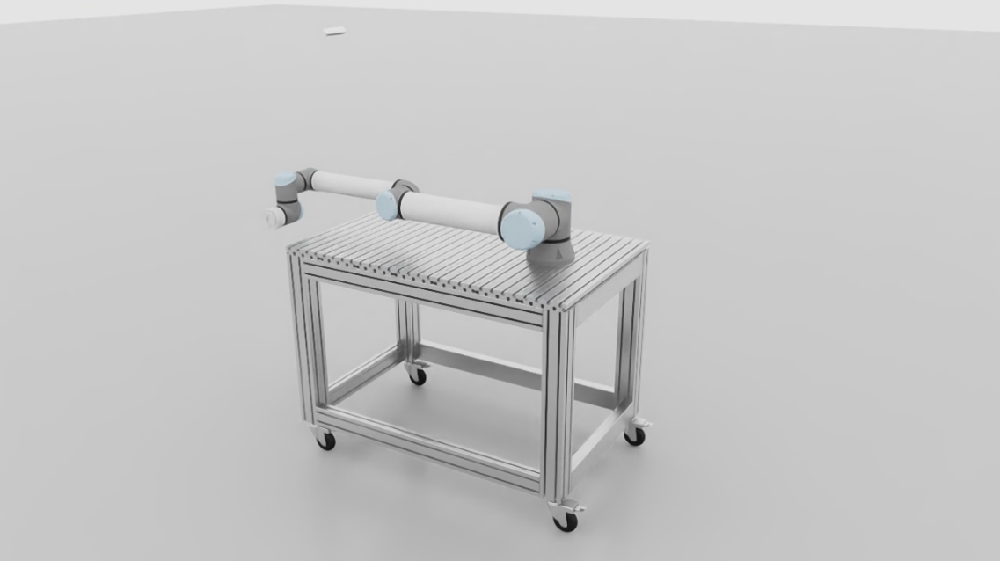

# Why?
We believe that a single source of truth for robot models simplifies development and integration. By maintaining only one model — defined in URDF — we ensure consistency across platforms. This URDF serves as the common origin for both ROS 2 and Isaac Sim, enabling a streamlined workflow between simulation and real-world deployment. 

Just follow the [Quickstart guide](#quickstart) to get a simulation up and running — with full hardware interface support for ROS 2.

For more details, check out our ROSCon DE 2024 presentation: ["ROS2 Workflows in Omniverse Isaac Sim: Digital Twins & ros2_control"](https://roscon2024.de/presentations/S3_P3__ROS2_Workflows_in_Omniverse_Isaac_Sim_Digital_Twins_ros2_control.pdf). Also see our CASE 2025 paper: ["Simulation-to-Reality Hyperparameter Optimization of MPPI Controllers via Bayesian Optimization in NVIDIA Omniverse Isaac Sim"](https://proximityrobotics.github.io/OmniMPPI/).

# PX Isaac Sim URDF Importer

The *PX Isaac Sim URDF Importer* builds on top of [Isaac Sim's URDF Importer](https://docs.isaacsim.omniverse.nvidia.com/4.5.0/robot_setup/ext_isaacsim_asset_importer_urdf.html#isaac-sim-urdf-importer) and extends its functionality. This repository includes a sample script that illustrates a way to use the importer to create a scene. It also provides an example of how ROS 2 nodes can be used in Isaac Sim to control imported robots.

⚠️ Note: This README applies only to the *main* branch (Isaac Sim version 4.5). If you're using the [*isaac-4.2*](https://github.com/ProximityRobotics/PX_IsaacSim_URDF_Importer/tree/isaac-4.2) branch with Isaac Sim version 4.2, please refer to its specific README.

## Table of Contents

- [First Setup](#first-setup)
- [Quickstart](#quickstart)
- [Usage](#usage)
- [Configuration](#configuration)
    - [Scene Description and Robot Description](#scene-description-and-robot-description)
    - [Mounts and ROS Domain ID](#mounts-and-ros-domain-id)
- [Simulation Example](#simulation-example)
    - [Command Line Arguments](#command-line-arguments)
- [Isaac URDF](#isaac-urdf)
    - [URDF Tag for Joint Drive Gains in Isaac Sim](#urdf-tag-for-joint-drive-gains-in-isaac-sim)
    - [URDF Tag for Sensors in Isaac Sim](#urdf-tag-for-sensors-in-isaac-sim)


## First Setup

- Clone this repository. 

- From the Omniverse Container Installation Documentation make sure that all the requirements under [***Container Setup***](https://docs.isaacsim.omniverse.nvidia.com/4.5.0/installation/install_container.html#container-setup) are met.

- Next, download the WebRTC Streaming Client from the 
[Latest Release](https://docs.isaacsim.omniverse.nvidia.com/4.5.0/installation/download.html#isaac-sim-latest-release) 
section.

- Now, you are set up to use to use Isaac Sim and the functionalities of this repository as described in the [Quickstart](#quickstart) section or the [Usage](#usage) section.


## Quickstart
1. Complete the [First Setup](#first-setup) if not already done.
2. Clone this project
    ```bash
    git clone https://github.com/ProximityRobotics/PX_IsaacSim_URDF_Importer.git
    ```

3. Clone Universal Robots ROS 2 description package
    ```bash
    cd <path-to-project>/humble_ws/src
    git clone https://github.com/UniversalRobots/Universal_Robots_ROS2_Description.git -b humble
    cd <path-to-project>
    ```

4. Specify USD scene and robot description file in the [config.env](config.env) file
    ```
    SCENE_DESCRIPTION=scenes/simple_scene/simple_scene.usd
    ROBOT_DESCRIPTION=/isaac-sim/project/humble_ws/install/ur_description/share/ur_description/urdf/ur.urdf.xacro
    ```
5. Build and run docker
    ```bash
    ./start_docker.sh
    ```
6. Build the ROS 2 workspace and run the simulation
    ```bash
    cd /isaac-sim/project/humble_ws
    colcon build
    . install/setup.bash
    run_simulation --fix-base --xacro-mappings '{"name":"ur10e", "ur_type":"ur10e"}'
    ```
7. Use the [WebRTC Streaming Client](https://docs.isaacsim.omniverse.nvidia.com/4.5.0/installation/manual_livestream_clients.html#isaac-sim-setup-livestream-webrtc) to connect to the simulation.

There should be two ROS 2 topics */joint_states* and */joint_commands* and the scene should look like this:


## Usage

- Before starting the Docker container, make sure to check out the [Configuration](#configuration) section to adjust the setup to your needs.

- Once everything is configured, you can build and run the Docker container from within the repository folder:
    ```bash
    ./start_docker.sh
    ```
    The working directory in the container should then be */isaac-sim*
- In case you need ROS 2 packages from the Humble workspace, build and source the environment:
    ```bash
    cd project/humble_ws
    colcon build
    . install/setup.bash
    ```
- Next, start the simulation with the example script as described in the [Simulation Example](#simulation-example) section, start your own script, or alternatively just start the Isaac Sim app in headless mode:
    ```bash
    /isaac-sim/runheadless.sh
    ```
- Lastly, wait some time until the simulation has started completely and then use the previously downloaded *Isaac Sim WebRTC Streaming Client* as described in its [documentation](https://docs.isaacsim.omniverse.nvidia.com/4.5.0/installation/manual_livestream_clients.html#isaac-sim-setup-livestream-webrtc) to begin live streaming.


## Configuration
The simulation example starts the simulation with a scene and imports a robot from a URDF or xacro file into the scene.


### Scene Description and Robot Description
The simulation example automatically reads the environment variables `SCENE_DESCRIPTION` and `ROBOT_DESCRIPTION`. They can be specified in the [config.env](config.env) and will be set automatically when starting the docker container.

The `SCENE_DESCRIPTION` variable holds the path to a USD scene. If the variable value...
- ... is empty, a scene with only a ground plane and a dome light will be created automatically.
- ... starts with "http", the given USD file will be loaded. This is meant to be used for NVIDIA Omniverse Assets like the full warehouse scene *ht<span>tp://</span>omniverse-content-production.s3-us-west-2.amazonaws.com/Assets/Isaac/2023.1.1/Isaac/Environments/Simple_Warehouse/full_warehouse.usd*.
- ... does not start with "http", it is expected to be a path relative to the *data/* folder (e.g. *scenes/my_scene.usd*) or an absolute path to the file in the ccontainer (e.g., **).

The `ROBOT_DESCRIPTION` variable holds the path to the robot description file. It can be a URDF or xacro file. If the variable value...
- ... is empty or does not end with ".urdf" or ".xacro", no robot is importet and the scene will remain as is.
- ... does end with ".urdf" or ".xacro", it is expected to be a path relative to the *data/* folder (e.g., *robots/my_robot.urdf*, or *robots/my_robot.xacro*) or an absolute path to the file in the container (e.g., */isaac-sim/project/humble_ws/src/my_description_package/urdf/my_robot.urdf*).


### Mounts and ROS Domain ID
In the [*start_docker.sh*](start_docker.sh) file four variables are defined as follows:
```sh
SRC_HOST="$(pwd)"/scripts
DATA_HOST="$(pwd)"/data
WS_HOST="$(pwd)"/humble_ws

DOMAIN_ID=0
```

The `DOMAIN_ID` is used as value for the `ROS_DOMAIN_ID` environment variable. 

The variables `SRC_HOST`, `DATA_HOST`, and `WS_HOST` hold paths to folders that will be mounted at */isaac-sim/project/scripts*, */isaac-sim/project/data*, and */isaac-sim/project/humble_ws* in the container.

```plaintext
/isaac-sim/  
├── project/ 
│   ├── scripts/
│   │   ├── run_simulation.py
│   │   └── ...
│   ├── data/
│   │   ├── robots/
│   │   └── scenes/
│   └── humble_ws/
│   │   ├── src/
│   │   └── ...
└── ... 
```


## Simulation Example
The simulation example script [run_simulation.py](scripts/run_simulation.py) 
- loads the USD scene defined with the `SCENE_DESCRIPTION` environment variable and imports the robot defined with the `ROBOT_DESCRIPTION` environment variable as described in [Configuration](#configuration),
- publishes the current simulation time every 0.1 s on a "clock" topic ([simulation_time_pub.py](scripts/simulation_time_pub.py)), and
- creates an articulation controller ([articulation_controller.py](scripts/articulation_controller.py)) that publishes the robot's current joint states on a "joint_states" topic and subscribes to a "joint_commands" topic to adjust the robot's joints.

The simulation example script can be executed with the `run_simulation` alias or with
```bash
/isaac-sim/python.sh /isaac-sim/project/scripts/run_simulation.py
```

You can also see how the simulation example script is used in the [Quickstart](#quickstart) section.

### Command Line Arguments
The simulation example script accepts the following command line arguments:
<table style="border: none;">
    <tr>
        <td style="border: none;">--fix-base</td>
        <td style="border: none;">Fix the robot's root link.</td>
    </tr>
    <tr>
        <td style="border: none;">--xacro-mappings</td>
        <td style="border: none;">Mappings for the xacro robot description file in JSON format, e.g., '{"key": "value"}'.</td>
    </tr>
    <tr>
        <td style="border: none;">--joint-commands-topic</td>
        <td style="border: none;">The name for the joint commands topic.</td>
    </tr>
    <tr>
        <td style="border: none;">--joint-states-topic</td>
        <td style="border: none;">The name for the joint states topic.</td>
    </tr>
    <tr>
        <td style="border: none;">--viewport-dimensions</td>
        <td style="border: none;">The width and height of the Isaac Sim viewport.</td>
    </tr>
    <tr>
        <td style="border: none;">--window-dimensions</td>
        <td style="border: none;">The width and height of the Isaac Sim window.</td>
    </tr>
    <tr>
        <td style="border: none;">--robot-position</td>
        <td style="border: none;">The robot's position in the world as x, y, z coordinate.</td>
    </tr>
    <tr>
        <td style="border: none;">--robot-orientation</td>
        <td style="border: none;">The robot's orientation in the world as quaternion w, x, y, z.</td>
    </tr>
    <tr>
        <td style="border: none;">--scene-position</td>
        <td style="border: none;">The scenes's position in the world as x, y, z coordinate.</td>
    </tr>
    <tr>
        <td style="border: none;">--scene-orientation</td>
        <td style="border: none;">The scenes's orientation in the world as quaternion w, x, y, z.</td>
    </tr>
    <tr>
        <td style="border: none;">--scene-scale</td>
        <td style="border: none;">The scaling factor for the scene in x, y, and z direction.</td>
    </tr>
    <tr>
        <td style="border: none;">--draw-point-cloud</td>
        <td style="border: none;">Draw the point cloud of any LiDAR imported from the robot description file.</td>
    </tr>
    <tr>
        <td style="border: none;">--enable-gpu-dynamics</td>
        <td style="border: none;">Enable GPU dynamics. Required for particle systems.</td>
    </tr>
</table>


## Isaac URDF

URDF allows you to add damping and friction to a joint but it does not support stiffness / drive strength. With URDF you 
do not have an xml element that contains the info that you need to create a LiDAR or camera sensor in Isaac Sim. Therefore, an 
`<isaac_drive_api>` tag for joints and tags to create sensors have been added. The following two sections describe how to use them. 

### URDF Tag for Joint Drive Gains in Isaac Sim
You can add the `<isaac_drive_api>` element to a joint in a URDF file as follows:
```xml
<joint name="my_joint" type="revolute">
    <origin xyz="0 0 1" rpy="0 0 3.1416"/>
    <parent link="link1"/>
    <child link="link2"/>
    <limit effort="30" velocity="1.0" lower="-2.2" upper="0.7" />
    <isaac_drive_api target_type="position" drive_type="acceleration" friction="1.0" strength="3000" damping="30000"/>
</joint>
```
You can set the target type (position or velocity), the drive type (force or acceleration), the joint friction, and strength and damping.
The documentation of the [Isaac Sim URDF Importer](https://docs.isaacsim.omniverse.nvidia.com/4.5.0/robot_setup/ext_isaacsim_asset_importer_urdf.html#isaac-sim-urdf-importer) 
explains the meaning of these parameters.

For position control (`target_type="position"`), the strength is interpreted as drive stiffness and damping is used as drive damping. For velocity control (`target_type="velocity"`), the drive stiffness is set to zero and the strength is used as drive damping. The strength and damping parameters can also be calculated from `natural_stiffness` and `damping_ratio` attributes in the `<isaac_drive_api>` element. How the calculations are done is described in the Isaac Sim URDF Importer documentation as well. The documentation also links the github repo of the open-sourced Isaac Sim URDF Importer.

The default values for a joint are target type "position", drive type "acceleration", friction 0.0, natural frequency of 25.0, and damping of 0.0. If the values are not specified in the URDF file, the strength parameter will be calculated from the natural frequency resulting in 625.0 and the damping will be 0.0.

A tutorial on how to tune the joint drive gains can be found at this [Omniverse Tutorial for Tuning Joint Drive Gains](https://docs.isaacsim.omniverse.nvidia.com/4.5.0/robot_setup/joint_tuning.html).

### URDF Tag for Sensors in Isaac Sim
You can add the `<sensor>` element as a child to an `<isaac>` element to a robot in a URDF file to create sensors in Isaac Sim as follows:

```xml
<link name="lidar_sensor"/>

<joint name="lidar_joint" type="fixed">
    <origin xyz="0 0 0" rpy="0 -1.5708 0" />
    <parent link="tool0" />
    <child link="lidar_sensor" />
    <axis xyz="0 0 0" />
</joint>

<isaac>
    <!-- sensor name must be name of link -->
    <sensor name="lidar_sensor" type="lidar">
        <topic name="lidar_sensor/points" msg_type="PointCloud2"/>
        <frame_id>lidar_sensor</frame_id>
        <config file="../config_files/my_lidar.json"/>
    </sensor>
</isaac>
```

The sensor *name* attribute needs to be the name of the link where the sensor is supposed to be positioned. 

The sensor *type* can be "lidar", "rgb_camera", or "depth_camera".

A `<sensor>`element can have multiple `<topic>` elements. They contain the topic *name* and message type *msg_type* for the repsective topic. For LiDAR sensors the messages can be *PointCloud2* or *LaserScan*. For cameras they can be *CameraInfo*, *Image*, and *PointCloud2*.

The `<frame_id>` element specifies the frame ID of the sensor.

The `<config>` element specifies the configuration file to use. There are three different ways to define it:
1. Like in the example above, it can be a path to a JSON config file. The path needs to be relative to the URDF file.
2. Another option is to use a path to a USD file that contains the sensor. In this case, the path can be relative to the URDF file or it can be an absolute path to an Omniverse asset on the cloud starting with "http". If the actual camera is not the default prim in the given USD file, the attribute *sensor* of the `<config>` element needs to be set. This is the prim path to the sensor prim in the USD stage.
3. For lidar sensors, you can also just use the lidar config file's name, e.g., "SICK_microscan3_ABAZ90ZAP01", if the directory is already in Isaac Sim's search path (setting "/app/sensors/nv/lidar/profileBaseFolder"). But this is also the reason why every lidar config file needs to have a unique name (in case 1. as well).

A camera config file has to contain the following parameters
```json
{
    "frequency": null,
    "dt": null,
    "resolution": [1280, 800],
    "render_product_path": null,
    "focal_length": 1.4,
    "focus_distance": 0.0,
    "f_stop": 0.0,
    "horizontal_aperture": 5.74,
    "vertical_aperture": 2.35,
    "clipping_range": [0.5, 10000000.0],
    "projection_type": "pinhole",
    "projection_mode": "perspective",
    "stereo_role": "mono",
    "shutter_properties": [0.0, 0.0]
}
```
but as in this example, they can be set to *null* if the default of the [Camera](scripts/sensors/camera.py) class should be used.

The available parameters for LiDAR configuration files are described at the [Omniverse Lidar Extension](https://docs.omniverse.nvidia.com/kit/docs/omni.sensors.nv.lidar/latest/lidar_extension.html) documentation.

